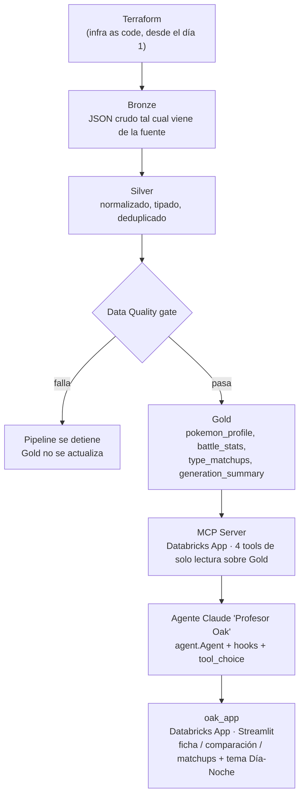
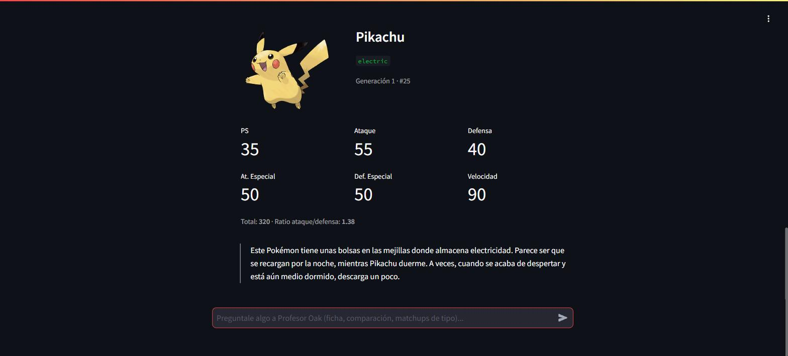
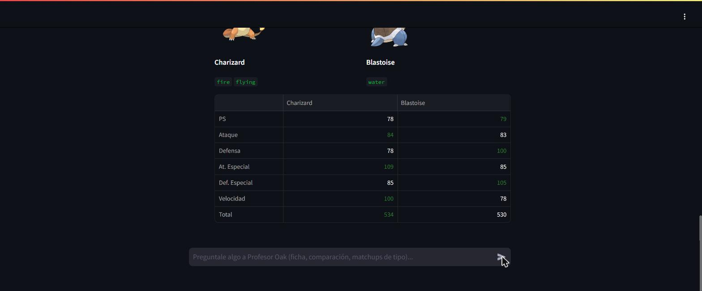
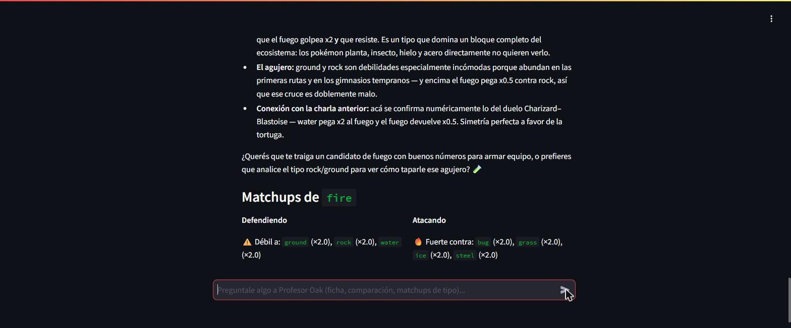
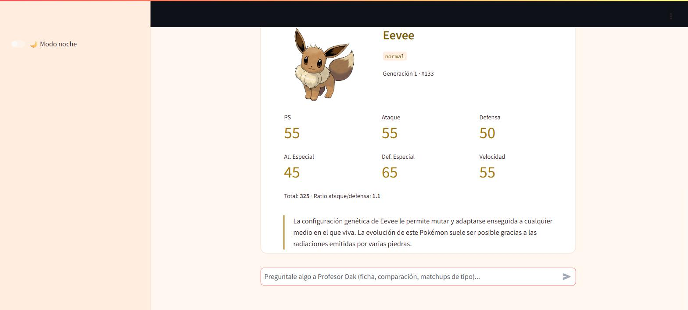
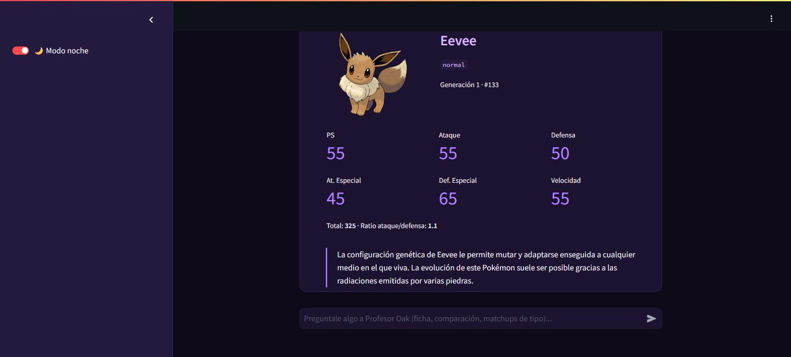

# Pokedex Agent — Databricks

Plataforma de datos Pokémon en Databricks (Terraform + Medallion) con un agente Claude ("Profesor Oak") que consume la capa Gold vía MCP — cada ficha, comparación y matchup sale de un pipeline de datos curado, sin inventar un solo stat.

**Demo en vivo:** [pokedex-oak-7405616363788532.12.azure.databricksapps.com](https://pokedex-oak-7405616363788532.12.azure.databricksapps.com) — requiere login al workspace de Databricks para verla (es una Databricks App, no un sitio público).

## Por qué este proyecto

Es, a la vez, dos cosas:
- **Portfolio de Data Engineering** — infra declarada desde el día 1 (Terraform), pipeline Medallion con Data Quality gate real, un MCP server propio sobre Unity Catalog, y un agente Claude con hooks y `tool_choice` reales, no un demo de juguete.
- **Material de estudio para el examen CCA-F** (Claude Certified Architect – Foundations) — cada componente ejercita a propósito algo puntual del temario (ver `reglas/06-ccaf-mapa-y-convenciones.md` para el mapa completo dominio del examen → pieza del proyecto).

## Arquitectura



**Next.js / Vercel — pieza exploratoria aparte.** Hay un segundo frontend (`frontend/` + `backend/`, Next.js + FastAPI) pensado originalmente para desacoplar el front de Azure/Databricks. Quedó bloqueado por un 401 intermitente en la propagación del permiso de un service principal M2M contra la Databricks App (causa del lado de Databricks, no de este repo — detalle completo en `reglas/07-estado-actual.md`). Se resolvió pivotando a una **segunda Databricks App en Streamlit** (`oak_app/`), que usa auth app-to-app automática en vez de M2M externo. El código de Vercel/Next.js queda en el repo sin desarmar, pero no es el plan activo.

## Fuentes de datos

El job de ingesta Bronze corre 5 fuentes en paralelo, todas de **PokeAPI** (`pokeapi.co` — gratis, sin key, sin restricción de uso comercial conocida): `pokemon_api_raw`, `pokemon_species_raw`, `pokemon_types_raw`, `pokemon_abilities_raw`, `pokemon_moves_raw`.

Dos fuentes más están documentadas pero todavía no ingeridas (no bloquean nada de lo de arriba):
- **pokemontcg.io** — cartas TCG, rareza, precios de mercado. Pendiente; si un pokemon no tiene carta, el diseño ya contempla `null` explícito, nunca un precio inventado.
- **Bulbapedia / wiki** — solo texto (lore), nunca imágenes de ahí (licencia CC BY-NC-SA, no comercial). Las imágenes siempre salen de PokeAPI (`official-artwork`).

## Capturas (producción real, `pokedex-oak`)

| Ficha de pokemon | Comparación | Matchups de tipo |
|---|---|---|
|  |  |  |

| Tema Día (Hada/Luz) | Tema Noche (Fantasma/Siniestro) |
|---|---|
|  |  |

## Cómo correr todo

### 1. Infra (Terraform)

```bash
cd terraform
cp terraform.tfvars.example terraform.tfvars   # completar anthropic_api_key
terraform init
terraform plan -out=tfplan.out
terraform apply "tfplan.out"
```

Esto crea el workspace, storage, catálogo Unity Catalog (`pokedex` con schemas `bronze`/`silver`/`gold`), el job del pipeline, y registra las dos Databricks Apps (`pokedex-mcp-server`, `pokedex-oak`) con sus service principals y permisos.

### 2. Correr el pipeline de datos

```bash
databricks jobs run-now --job-id <pipeline_job_id>   # ver terraform output pipeline_job_id
```

### 3. Deployar/redeployar las Databricks Apps

El primer `terraform apply` ya deja las dos apps en `RUNNING`. Para subir código nuevo después de un cambio (Terraform sube los archivos al workspace pero **no** redeploya solo — Databricks Apps es snapshot-based):

```bash
databricks apps deploy pokedex-mcp-server --source-code-path /Workspace/Shared/pokedex/mcp_server
databricks apps deploy pokedex-oak --source-code-path /Workspace/Shared/pokedex/oak_app
```

### 4. Correr el agente en local (sin las Apps)

```bash
cp .env.example .env   # completar
python agent/cli.py
```

### Variables de entorno (nombres, sin valores)

**`.env` local** (agente/backend, ver `.env.example`):
`ANTHROPIC_API_KEY`, `ANTHROPIC_MODEL`, `MCP_SERVER_URL`, `DATABRICKS_PROFILE`, `DATABRICKS_HOST` (opcional, solo para el camino M2M/Vercel bloqueado).

**`terraform.tfvars`** (ver `terraform.tfvars.example`):
`project_prefix`, `environment`, `location`, `catalog_name`, `sql_warehouse_id`, `anthropic_api_key`.

**`oak_app`** — no necesita `.env`: `ANTHROPIC_API_KEY` viene de un Databricks secret inyectado por Terraform, y la auth contra el MCP server es automática (service principal propio de la app).

## Estado del proyecto

Detallado, con hallazgos reales y qué falta: [`reglas/07-estado-actual.md`](reglas/07-estado-actual.md). El resto de `reglas/` documenta las decisiones de arquitectura por dominio (datos, infra, agente, frontend, seguridad, mapa al examen CCA-F).
